## DOCUMENTATION OF PROJECT 11

### STEP1:-
1. I launched an ec2-instance and tagged it Jenkins-ansible.
2. I installed Jenkins and all necessary dependencies, then I login in to it through my webpage and made all necessary configurations for it to work. 

    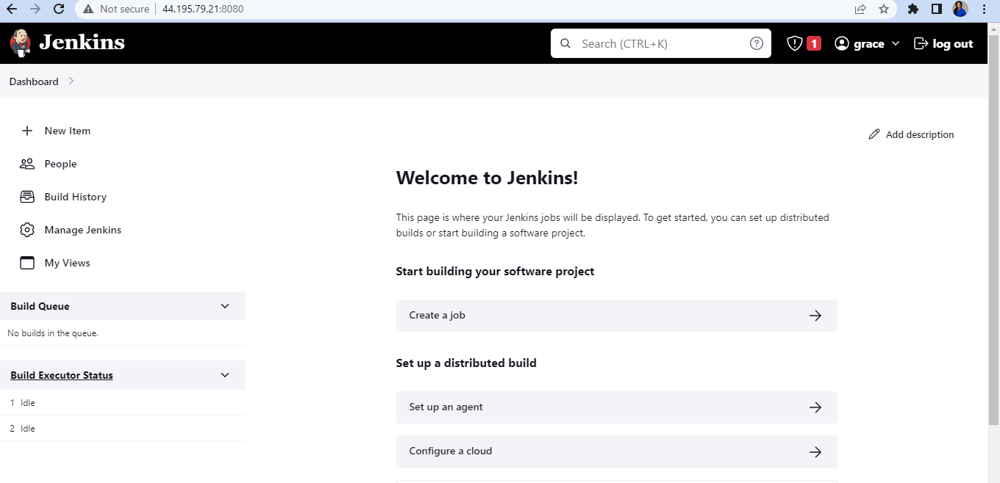
3. I created a new repository in my Github account and tagged it "ansible-config-management" because I have one tagged as "ansible-config-mgt" already. Then I created a webhook and connected it to ansible, the freestyle project I created on Jenkins console. I confirmed if the webhook worked well by running a build test, then it worked very fine.

    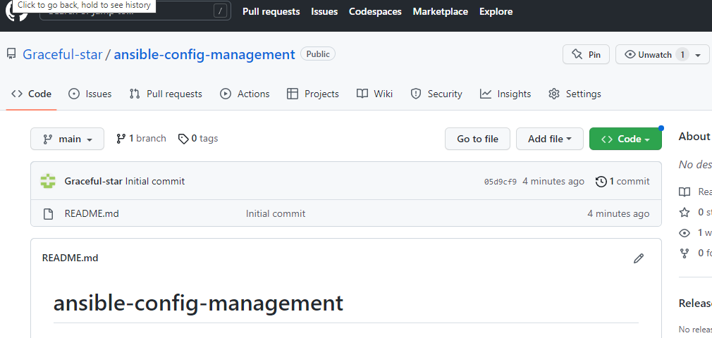
    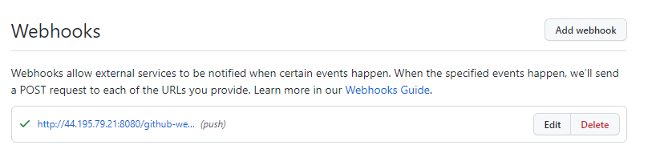
    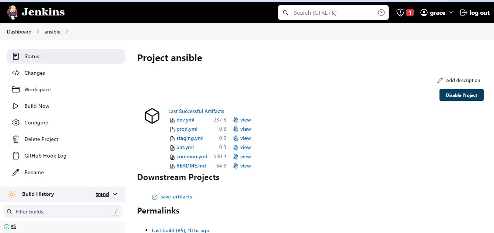
    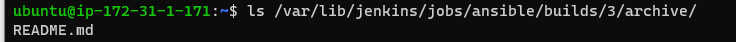

4. I installed ansible and confirmed it's version
     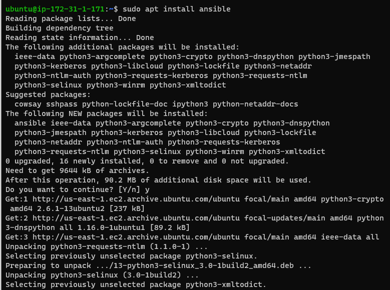
     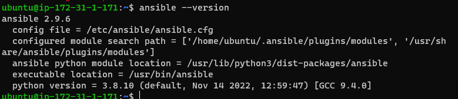

## STEP 2:-

1. I cloned down my "ansible-config-management" to my VS Code
2. I created a new branch and tagged it "new"
3. I created two new directories namely; inventory and playbook
4. I created four .yml files in the inventory directory;
    a. dev.yml
    b. staging.yml
    c. uat.yml
    d. prod.yml

  Then I created common.yml file in the playbooks directory
       
       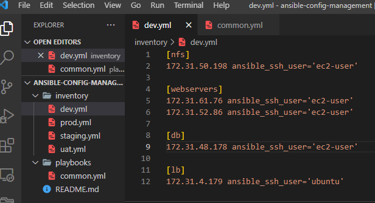

## STEP 3

1. I tried setting up ssh-agent for ansible to be able to work but I got a bug that has to do with permissions on my laptop. I changed permissions serveral times but all to no avail. I'm still working on it for now
       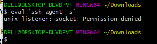

2. I updated the files created with the necessary instructions required to run ansible well

## STEP 4
1. I commited my files
2. I created a pull request too
3. Then I mergeed the request to the "main" directory
    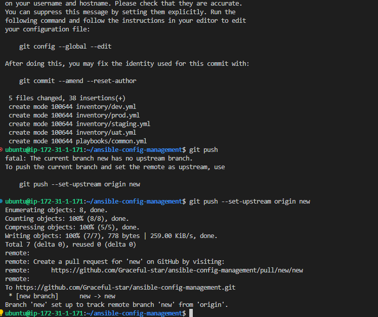
    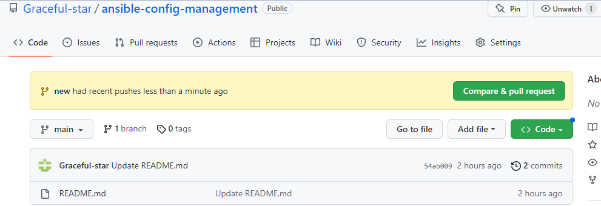
    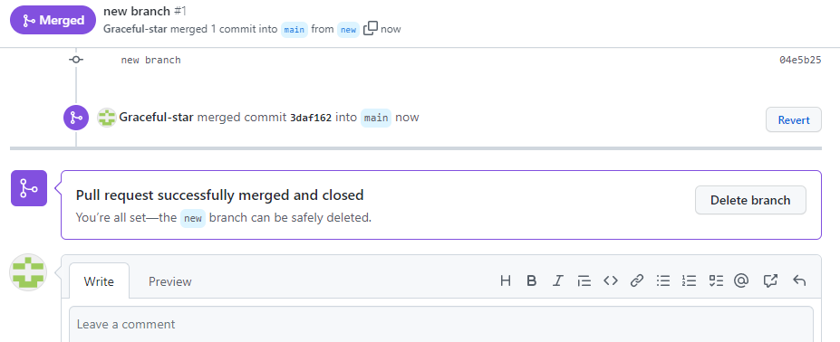

