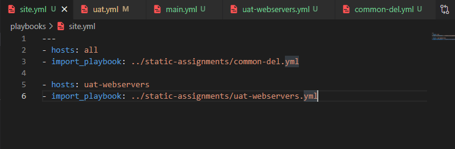

# ANSIBLE REFACTORING AND STATIC ASSIGNMENTS

## STEP 1:- 
1. I created a new directory; "ansible-config-artifact" and I changed permissions to the directory
     
2. On jenkins console, I installed "copy artifact" plugin then I created another freestyle project named save_artifacts which I configured accordingly
      
          
      

3. I tested the setup and it worked very much well
      
      

## STEP 2:-

1. I created a new file in Playbooks folder and named it site.yml
2. I created a new folder in the root repository and named it "static-assignments"
3. I moved "common.yml" file into the newly created folder then I configured the file to import playbook
       
       

## STEP 3:-

1. I launched two new ec2-instances and tagged them web-uat
            
2. I created a new directory named Roles and I initialized Ansible-galaxy webserver
             
             

3. I updated my ./inventory/uat.yml file with the IP address of my uat-webservers
              

4. Then I provide a full path to my Roles directory in the ansible.cfg file
              

5. I wrote some configuration tasks in the main.yml file of the tasks directory
              

6. I created a new file; uat-webservers.yml in the static-assignments folder so as to create new assignments for the uat-webservers
              

7. Then I refered the uat-webserver's role in my site.yml file
                

                

